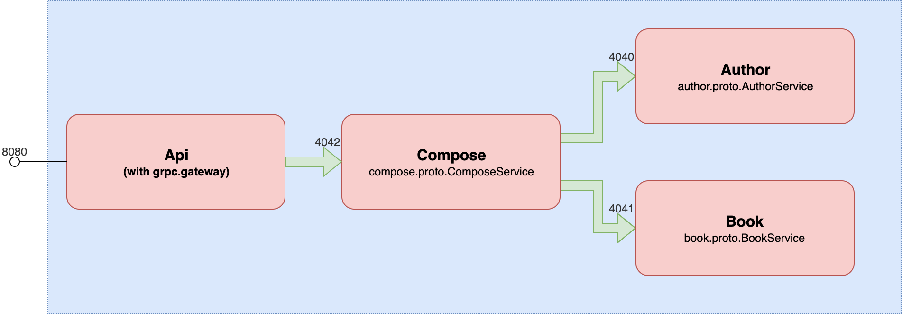

# gRPC Golab 19

Demo for microservice talk in Golab Florence 2019. This demo is focused on gRPC microservices.

The application is built with 3 microservices:



It exposes a REST API using [grpc-gateway](https://github.com/grpc-ecosystem/grpc-gateway).

## Run the demo

Execute the docker-compose:

```sh
docker-compose build && docker-compose up
```

## Test

With the tool [grpcurl](https://github.com/fullstorydev/grpcurl), it is possible to send a request to the `compose` microservice exposed in port 4042.

```sh
grpcurl -plaintext -d '{"id": 1}' 127.0.0.1:4042 compose.proto.ComposeService/GetAuthor
```

The expected result is:

```json
{
  "id": "1",
  "name": "Miguel de Cervantes",
  "books": [
    {
      "id": "1",
      "name": "Don Quixote"
    },
    {
      "id": "2",
      "name": "Rinconete and Cortadillo"
    },
    {
      "id": "3",
      "name": "Exemplary novels"
    }
  ]
}
```

In order to test the REST API:

```
curl -v http://localhost:8080/authors/2
```
